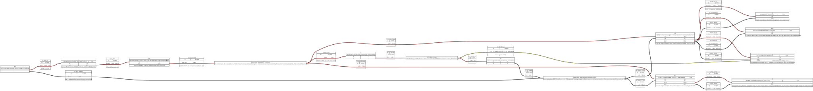
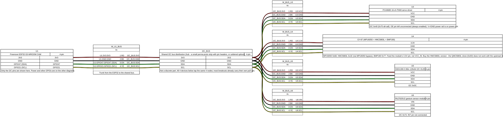
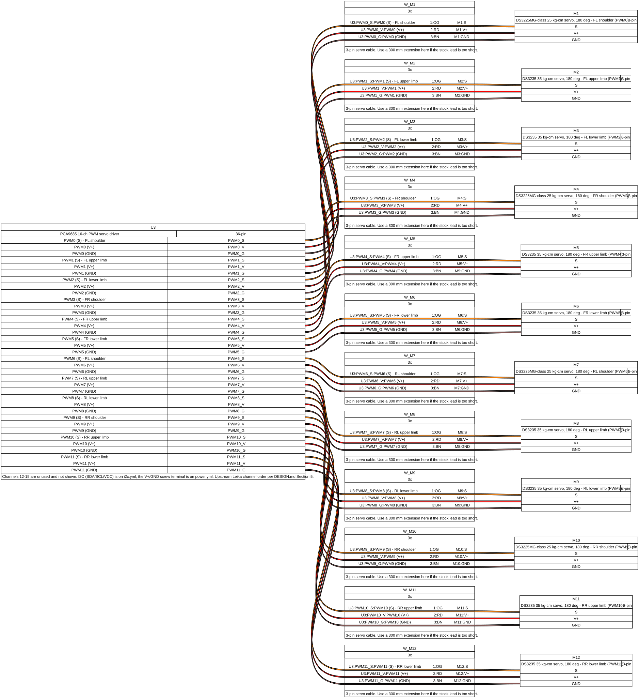
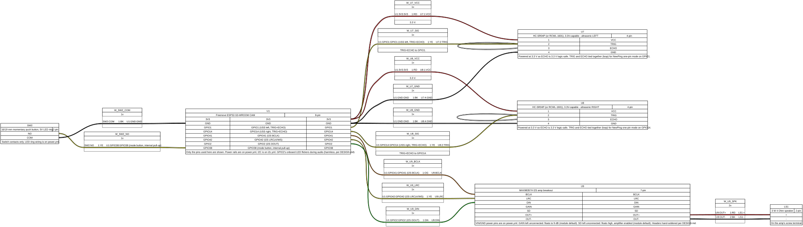
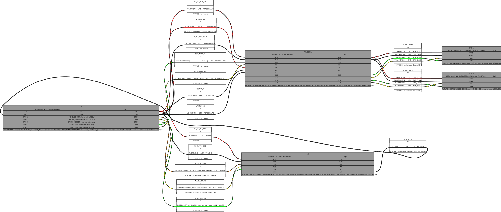

# RobotDog wiring diagrams

These are [WireViz](https://github.com/wireviz/WireViz) (0.4.1) harness diagrams for
every electrical connection on RobotDog. **The source of truth is
[`docs/DESIGN.md`](../../docs/DESIGN.md)** (parts list, power tree, wire gauges,
ESP32 pin map, I2C addresses, servo channels, future provisions) and
[`docs/REQUIREMENTS.md`](../../docs/REQUIREMENTS.md). If a diagram and DESIGN.md
ever disagree, DESIGN.md wins - fix the diagram (or raise the discrepancy) rather
than trusting the picture.

## Files and what each one covers

| Diagram | Covers |
|---|---|
| [`power.yml`](source/power.yml) | Battery -> fuse -> main switch -> power distribution -> PS1 (6.3 V servo rail) and PS2 (5.0 V logic rail); the R1/R2 battery-sense divider into GPIO3. |
| [`i2c.yml`](source/i2c.yml) | The shared I2C bus (GPIO47 SDA / GPIO21 SCL, 3.3 V) to the PCA9685, GY-87, SSD1306 OLED, and PAJ7620U2, with each device's I2C address noted. |
| [`servos.yml`](source/servos.yml) | PCA9685 channels PWM0-PWM11 to servos M1-M12, one 3-wire (signal/V+/GND) cable per leg joint, in the upstream Leika channel order. Channels 12-15 are unused. |
| [`peripherals.yml`](source/peripherals.yml) | The two HC-SR04P ultrasonic sensors (one-pin TRIG+ECHO mode), the MAX98357A I2S amp and speaker, and the SW2 mode-button switch contacts. |
| [`future.yml`](source/future.yml) | **Reserved, not-installed** wiring only: the INMP441 mic and the TCA9548A I2C mux + two eye OLEDs. |

Each diagram redeclares the ESP32 (`U1`) and any other shared part (e.g. `SW2`,
`U9`) with only the pins that diagram wires up - check every file for a device's
full connections.

## Rendering

```sh
make -C hardware/wiring          # render every diagram that changed
make -C hardware/wiring clean    # remove all generated output
```

This runs `uv run wireviz -f hst -o output <file>.yml` for each `source/*.yml`
(`uv` finds the repo's `pyproject.toml` by walking up). Each render writes a
`.html`, `.svg`, and a `<name>.bom.tsv` bill of materials for that diagram into
`output/`; all three are committed. PNG output is skipped because the SVGs are
sharper and diffable. Edit only the files in `source/` - everything
in `output/` is generated. The WireViz `.gv` (Graphviz source) intermediate is
not committed - it's regenerated on every render and is listed in the repo's
`.gitignore`.

## The FUTURE convention

`future.yml` is the only diagram that shows reserved-but-not-installed wiring.
In it:
- Every connector has a grey background and a note starting `FUTURE - NOT
  INSTALLED` (or `FUTURE ONLY` for the ESP32 pins it taps, which are already
  wired for other, installed devices in `power.yml`/`peripherals.yml`/`i2c.yml`).
- Nothing in `power.yml`, `i2c.yml`, `servos.yml`, or `peripherals.yml` is
  future/reserved - everything there is installed on the robot today.

## Renders






